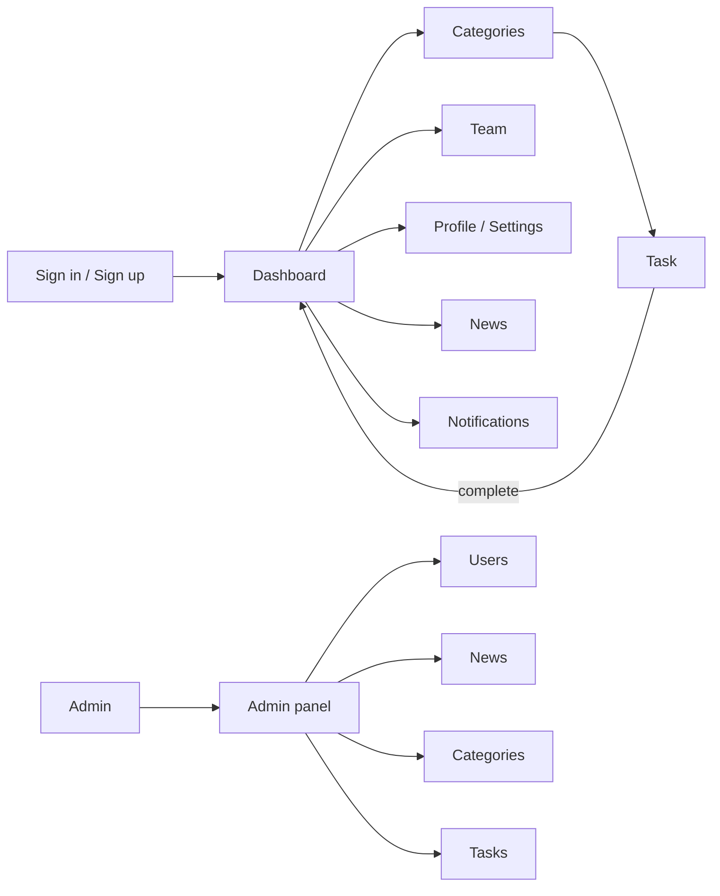

# Codeby Team Platform


Frontend for a gamified training platform for [Codeby Academy](https://codeby.net/) — an information security / penetration testing community. Users complete challenges organized by category (administration, cryptography, forensics, etc.), earn points, compete on leaderboards, and can join teams. Admins manage users, news, categories and challenges through a separate panel.

> [!NOTE]
> This repository is the frontend I delivered as a freelancer, built from a Figma design provided by the client. No backend was part of the brief. Codeby's team later took the project further and added their own backend — that work is not part of this repo, and codeby.net today no longer runs this codebase.

---

## Why it exists

Codeby needed an interface for their training platform: a place where students see their progress, browse and solve challenges by category, and compare results with others, while staff manage the content behind it. I was brought on to implement that interface from their design, end to end, across the user and admin views.

## User flow



Role determines what's reachable: the admin panel route redirects non-admin users back to the dashboard (see [pages/admin.tsx](pages/admin.tsx)).

---

## Key decisions

- **Redux Toolkit, one slice per feature (`user`, `modal`, `mobileMenu`)** — the UI has cross-cutting state (active modal, current role, mobile nav) that many unrelated components need to read or trigger. Slices kept each concern isolated instead of one large global store. Trade-off: for a UI-only project without a backend, some of this could have lived in local component state or context — Redux was chosen to match patterns the client would extend later.
- **Role stored client-side with no auth backend** ([redux/user/slice.ts](redux/user/slice.ts)) — since authentication wasn't in scope, the user's role (`admin` / `user`) lives in Redux state, defaulted to `admin` so both views are reachable for review. This made the two UIs (user-facing vs. admin) demonstrable without a real login flow, at the cost of not being a real auth boundary.
- **Mock data instead of API calls** ([helpers/](helpers)) — challenges, categories, leaderboard entries and users are static arrays, not fetched. The brief was markup and interaction, not data-fetching, so components were built to accept the data shape they'd eventually receive from a real API rather than to call one.
- **CSS Modules (`.module.scss`) colocated per component** — one stylesheet per component folder, scoped by default, instead of a global stylesheet or a CSS-in-JS library. This keeps styles close to the markup they belong to and avoids class name collisions across a fairly large component tree.
- **`components/` vs. `page-components/`** — a split between generic, reusable UI primitives (`Button`, `Input`, `Select`, `Badge`, `Modal`) and page-specific composed blocks (`Dashboard/*`, `Admin/*`, `Team/*`). It keeps the primitive layer free of business/domain knowledge and makes it clear where to add a new screen versus a new base component.

---

## Stack

| Layer | Technology | Role in this project |
|---|---|---|
| Framework | Next.js 13 (Pages Router) | Routing, SSR-capable page shells |
| Language | TypeScript (`strict`) | Type safety across components, state and mock data |
| State | Redux Toolkit + React Redux | Cross-cutting UI state: role, modals, mobile nav |
| Styling | Sass / CSS Modules | Per-component scoped styles |
| Charts | Recharts | Points/progress charts on the dashboard and profile |
| Animation | Framer Motion | Transitions (modals, menus) |
| Icons | SVGR (`@svgr/webpack`) | SVGs imported as React components |

`next-auth` and `axios` are listed in `package.json` but not used anywhere in the code — they were added ahead of an auth/API integration that was never part of this brief.

---

## Run locally

```bash
git clone <repo-url>
cd codeby-team-platform
yarn install
yarn dev
```

Open [http://localhost:3000](http://localhost:3000). No environment variables are required — there is no backend or external API to configure.

<details>
<summary>Other scripts</summary>

| Script | What it does |
|---|---|
| `yarn dev` | Starts the Next.js dev server |
| `yarn build` | Production build |
| `yarn start` | Serves the production build |
| `yarn lint` | Runs `next lint` |

</details>

## Project structure

```
.
├── pages/            # Next.js routes (sign in/up, dashboard, categories, team, admin, settings, ...)
├── page-components/  # Composed, page-specific blocks (Dashboard, Admin, Team, Profile, ...)
├── components/       # Reusable UI primitives (Button, Input, Select, Modal, ...)
├── layout/           # Header, Sidebar, page layout wrapper
├── redux/            # Redux Toolkit slices + selectors (user, modal, mobileMenu)
├── hooks/            # Shared hooks (e.g. useWindowSize)
├── helpers/          # Static mock data (categories, users, leaderboard)
├── types/            # Shared TypeScript types
└── styles/           # Global and page-level Sass
```

---

## Tests and status

There are no automated tests. This repo is a frontend snapshot delivered at the end of the engagement — it was not maintained afterward, so it reflects the state at handoff rather than an actively developed product.

## License

No license file is included. There was no written contract for this engagement — it was an informal freelance job. The code is shown here for portfolio purposes.
